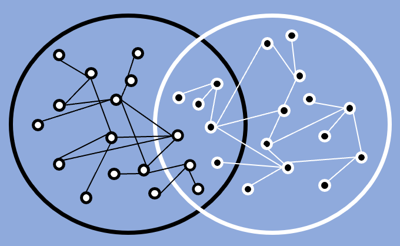

# Metabolic Set Theory

  

### "Leveraging agent-based modeling and co-occurrence data to validate a generalized metabolic model of species interaction in the human gut microbiome" by Jyoti Jyoti, Hannah Zoller, Wolfgang zu Castell, and Marc-Thorsten Hütt.

Link to publication: TBA

## Overview
Understanding the composition of microbial communities in their environment remains a challenge due to the complex interplay of factors like inter-species interactions and nutrient availability. In this context, it has become an established approach to use overlap in functional subsets of metabolic networks as indicators of synergy and competition among microorganisms. Here, we show that this idea can actually be reduced to a much simpler principle. Leveraging the agent-based community modeling software BacArena and natural co-occurrence patterns in the human gut microbiome for a systematic comparison, we find that simple set-theoretical levels explain interactions to a similarly high degree as more sophisticated, established approaches based on network topology. Furthermore, we observe that the performance of most indices decreases substantially for patients diagnosed with obesity or inflammatory bowel disease, suggesting a systemic decline in the microbiome.

---

## Folder Structure
This repository contains the following main subdirectories:

### `_ModelsAndNetworks`
This subfolder contains genome-scale metabolic models (GEMs) for ten bacterial species, downloaded from https://vmh.life/ and provided as a demonstration set. These models are processed with the Jupyter notebook `_ModelsAndNetworks/_Model_to_network_script.ipynb`, which generates metabolic networks in the form of edge lists and adjacency matrices. The script also extracts the exchangeable metabolites and biomass reactions associated with each model.

### `1_BorensteinImitation_Indices`, `2_Set_Indices`, `3_LayeredNetwork_Indices`, `4_NodeAndEdge`
Each of these folders contains a Jupyter notebook that takes metabolic networks from `_ModelsAndNetworks` as input and generates filtered networks, network-layers and interaction indices for the respective index type. The outputs are saved in the three subfolders. 

`0_FilteredAdjacency`: Contains the resulting filtered metabolic networks after removing *glycan* compounds, *currency* metabolites and *small weekly-connected* components. 

`1_SpeciesMetaLayers`: Contains the resulting network layers (non-overlapping sets of node) derived from the respective layering procedure for all ten species.

`2_Indices`: Contains the resulting competitive and synergistic indices obtained from comparing equivalent and non-equivalent layers of the metabolic networks.

For details, please refer to the associated publication (TBA).

### `Figures`
The subfolder contains the figures that represent correlations between 

**(a)** the interaction indices and *shared-* and *cross-feeding* of microbes in simulated co-cultures of the species (using the agent-based community modeling tool *BacArena*).

**(b)** the interaction indices and *in-vivo* co-occurrences patterns of the species.

---

## Requirements
Jupyter notebooks are compatible with Python >= 3.8.15

Package versions are listed in `requirements.txt`.

---

## References
1. R. Levy and E. Borenstein. “Metabolic modeling of species interaction in the human microbiome elucidates community-level assembly rules”. In: Proceedings of the National Academy of Sciences 110.31(2013), pp. 2804–12809. https://doi.org/10.1073/pnas.1300926110
